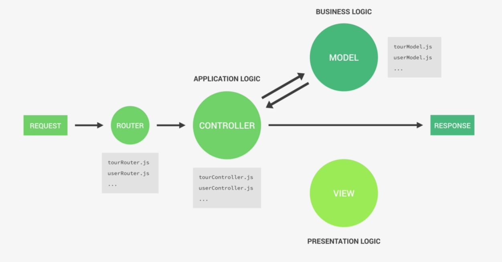

A dynamic web application built to learn and experience server side web development using Node.js, Express, MongoDB

- DEVELOPMENT PROCESS
    - Using Express for routing and making Http requests
        - Step 1: Create simple APIs (updating local files for now) using RESTful architecture ==> CRUD Operations created
        - Step 2: Having more resources like tours, users, etc, it's better to create routers and mount these routers to the respective resources.
        - Step 3: Refactoring the app.js into seperate components and apply MVC framework
        |-- server                  # To start the server
        |-- app                     # express app
        |-- routes                  # endpoints
            |-- tourRoutes
            |-- userRoutes
        |-- controllers             # C in MVC: control the request from endpoints to data in local files (for now)
            |-- tourController
            |-- userController
        - Step 3: Set up a public route as a root folder to serve static files by `app.use(express.static(${__dirname}/public`));

    - Set up Environment Variables in `config.js` to configure the environment is devlopment/production, etc. Then link this file to the application by using the npm package called `dotenv`

    - MONGODB
        - Create a DB on MongoDB Atlas, connect it to MongoDB Compass on desktop
        - Connect the MongoDB Atlas DB to Express App using Mongoose:
            Mongoose is an Object Data Modeling (ODM) library for MongoDB and Node. js. It manages relationships between data, provides schema validation, and is used to translate between objects in code and the representation of those objects in MongoDB
        - Mongoose:
            - Create schema --> create a model based on that schema --> create new document based on that model --> call .save() method to save it to DB
    
    - Refactor the app structure using USE MVC model <a href="https://github.com/ngannguyen117/Natour-Node.js/commit/4175fe7063f0334a0f5ef57fa21793a479cbd482">#4175fe7</a>
        

        Removed <a href="https://github.com/ngannguyen117/Natour-Node.js/commit/5516fa79474cf1df628bdfeb5cfc8c9ea021aad8">Param Middleware</a> in `tourController` & `tourRoutes`

        |-- server                  # To start the server, connect to mongoDB DB
        |-- app                     # express app
        |-- routes                  # endpoints
            |-- tourRoutes
            |-- userRoutes
        |-- controllers
            |-- tourController
            |-- userController
        |-- models
            |-- tourModel

    - Update CRUD operations on tours. The `tourController` makes changes to the tourModel (which will then update the tours collection in natours db on Atlas) instead of text files using `fs.readFiles()` or `fs.writeFiles()`
    - Add more data to the tour schema. Wrote script to import data from `tours-simple.json` to database
    
